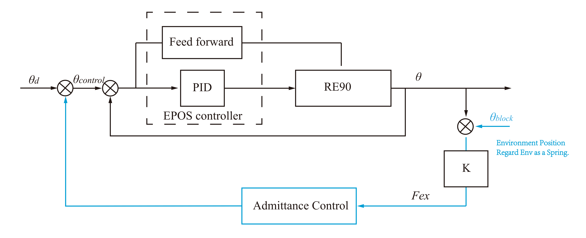

## 力传感器单片机接收测试 

```c
/* 2000Hz 采样频率  平均接收一个数据，遗漏一个数据 */
debug initing ... 
beginning
0-252	
1-254	
2-256	
3-258	
4-260	
5-262	
6-264	
7-266	
8-268	
9-270	
10-272	
11-276
    
/* 1000Hz 单纯接收，不打印出接收数据/并未搭载算法时，未遗漏一个*/
debug initing ... 
beginning
0-17	
1-18	
2-19	
3-20	
4-21	
5-22	
6-23	
7-24	
8-25	
9-26	
10-27	
11-28	
12-29	
```


## 导纳控制




### 1. 纯弹簧 K

单纯  $F = k\theta$  没有质量块也没有阻尼。

电机命令求解方法：
$$
\theta = \frac{F}{k}
$$


> 大刚度

<video src="img/刚度大.mp4" width=30% ></video>
> 小刚度

<video src="img/刚度小.mp4" width=30%></video>
> 正弦波轨迹+弹簧特性

<video src="img/正弦波.mp4" width=30%></video>
**调试问题和奇特现象** 

> 调试过程控制器会无缘无故的报错，调查CAN线上的报文，发现在报错的同时会发出协议错误的EMCY帧？
>
> ***目前还未解决*** 

```c
12372	接收	20:22:29.608		

EMCY	Error Code="Protocol Error"; Error Register="0x10 "; Manufacturer Specific="0x00 00 00 00 00 "; 	

帧ID:00000086 数据帧 标准帧 DLC:08 Data:50 82 10 00 00 00 00 00 	
```


> 电机在偏离目标角度较大的时候会发生抖动

分析的原因有两个

1. 力矩传感器存在较大的方差，需要使用较强的滤波器才能消除。 之后的实验也表明，确实存在这方面的原因。添加一阶两阶滤波器后，明显在角度较小的时候不存在抖动的情况了
2. 在力矩较大的时候（角度较大的时候），单靠人手无法提供稳定的力矩，导致人机交互的传递函数发送变动，系统可能会在某一瞬间不稳定，因此会存在抖动


> 施加滤波器后，手动拨动电机使其偏离较大的角度，突然放手，滤波后的力会慢慢降为0

未添加滤波器前，除去传感器噪声这一缺点，拨动电机偏离目标角度突然放手后，电机会刷的运动回目标角度。原因是放手后的控制电机的方式是位置控制，从而当这个目标值与拨动时刻的电机角度值差距较大时，控制容易饱和，导致不稳定最终因电流过大而启动保护模式断开电源。 

添加滤波器后，可以变相的控制放手后的**残余力**，从而使电机以一定的轨迹返回目标角度。**这与弹簧-阻尼-质量块有异曲同工之妙**。


### 2.  弹簧+质量块

核心代码

```c
// 0.01 - 采样周期 s
// /360.0*4096.0*4.0 - 度转qc
// currentForce - Nm
// Km - Nm/°
// x_target - °
// xdot - °/s
x_ddot = (currentForce - Km*x_target)/Jm;
xdot =  xdot + x_ddot*0.01;
x_target = x_target + xdot*0.01;

int x_int = x_target/360.0*4096.0*4.0;
Pos_SET_VALUE_node5 = x_int;
```


质量0.1

<video src="./img/弹簧-质量块2.mp4" width=50%> </video>
[质量 0.01](.img/springmass-0-001.mp4) 


<video src="./img/springmass-0-001.mp4" width=50%> </video>


**调试问题和现象** 

> 程序容易在力矩传感器还没去皮时启动了PDO控制，导致有初始的力矩数值，出现电机剧烈抖动，然后再收敛到目标点的情况。

去皮过程中，可以添加延迟 或者 添加去皮完成标志位。

> 在核心代码中计算x_ddot时，x_traget不可以替换成实际的电机角度，这样会导致电机摆动幅度越来越大，最终不收敛。

导纳本质还是力矩大闭环，弹簧阻尼质量块本质只是力矩输入的滤波器，所以不需要在速度这里引出搞一个闭环。


### 3. 弹簧+阻尼+质量块


$$
F_{ex} = J_m\ddot\theta + D_m\dot\theta + K_m\theta
\\ similar\ \  to
\\ 
F_{ex} = \ddot\theta + 2\zeta\omega\dot\theta + \omega^2\theta
$$
$\omega = \sqrt{\frac{K_m}{J_m}}$  - 越大，施加 $F_{ex}$ 后返回目标位置越快，没有 $\zeta$ 时震荡频率越大

$\zeta = \sqrt{\frac{D_m^2}{4*K_mJ_m}}$ - 越大，施加 $F_{ex}$ 后缓慢回到目标位置，大于0.707时返回过程没有 overshoot. 


核心代码

```c
// 0.01 - 采样周期 s
// /360.0*4096.0*4.0 - 度转qc
// currentForce - Nm
// Km - Nm/°
// x_target - °
// xdot - °/s

x_ddot = (currentForce - Km*x_target - Dm*xdot)/Jm;
xdot =  xdot + x_ddot*0.01;
x_target = x_target + xdot*0.01;

int x_int = x_target/360.0*4096.0*4.0;
Pos_SET_VALUE_node5 = x_int;
```


阻尼比 < 0.707, 存在 overshoot； 质量较大，所以调整速度较慢

<video src="./img/弹簧-阻尼-质量块.mp4" width=50%></video>
阻尼比 = 1,  不存在 overshoot；Jm = 0.001，较大，所以调整速度较慢

<video src="D:.\img\阻尼比1质量0、001.mp4"  width=50%></video>
阻尼比 = 1,  不存在 overshoot；Jm = 0.0001，较小，所以调整速度较快

<video src=".\img\阻尼比1质量0-0001.mp4"  width=50%></video>
**调试问题和现象** 

> 当电机偏离目标角度较大的时候，力矩传感器有时候会采集到很大的值，导致很大的控制力，调试时容易受伤。

目前尝试在使用力矩值的时候采用中值滤波器，有一定的效果。


## 跟随控制

控制框图


参数选择

导纳控制模型中，$w$越大，则跟随速度越快，交互力能够更快的到0。$\zeta$ 越大，则跟随过程中不会出现超调，即交互力 0 且脱离交互。


[某次测试结果](零力矩控制.xlsx) 

> 由于传感器在没有力施加的时候会存在噪声，而跟随控制是基于交互力进行控制的，所以会发生剧烈抖动。所以添加了控制的阈值，是0.05Nm。 
>
> 即 当 -0.05Nm < 传感器 < 0.05Nm 时，F交互 = 0Nm.


视频资料


<video src=".\img\零力矩控制.mp4"  width=50%> </video>


